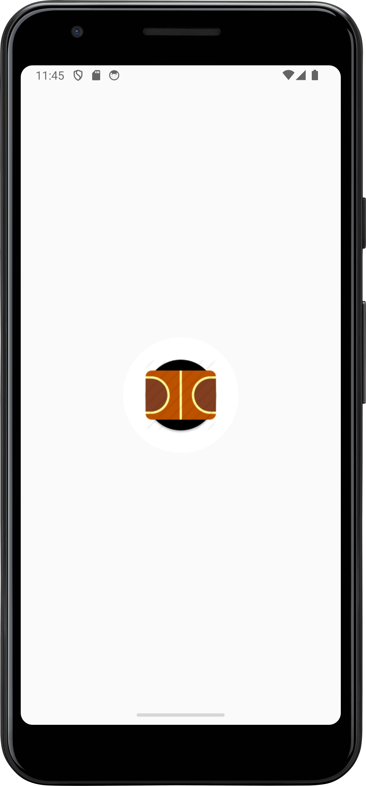
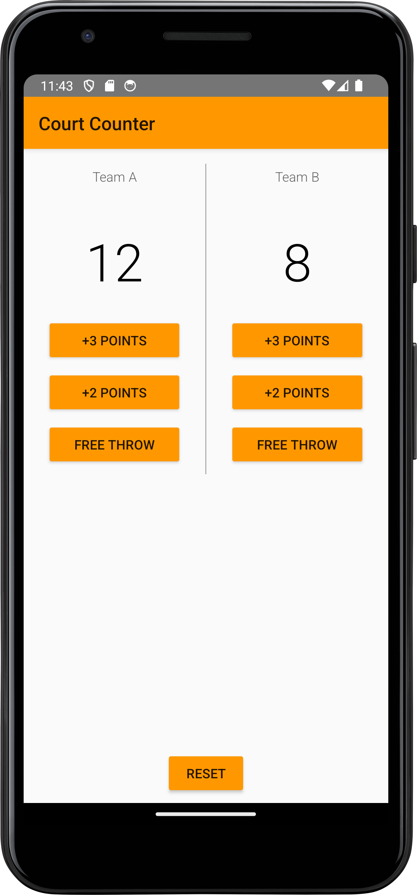

## Basket Score Keeper

This is a simple Android app that allows users to keep track of the score in a basketball game. The app has two screens: a splash screen and a main screen.

### Screenshots

Here are some screenshots of the app:

    
    

### How to Use

To use the app, simply open it on your Android device and start keeping track of the score in your basketball game. You can increase the score for each team by tapping the corresponding button on the main screen.

### License

This project is licensed under the [MIT license](./LICENSE.md).
